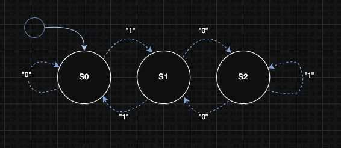
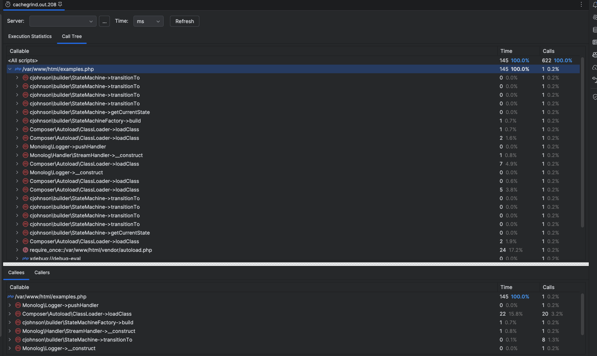

# Modulo 3 Exercises - State Machine Exercise





- Built on PHP 8.3 using Docker and PHPStorm.
- Scanned with PHPStan using the default level.
- Scanned with phpcs using PSR-12 standard.
- Tested with PHPUnit.


After checkout, installing the project is simple:
```bash
composer install
```

How to run the tests:
```bash
user@container:/var/www/html# composer run-script test 
```

If you want to see test results in a more detailed format, run:
```bash
./vendor/bin/phpunit --testdox
```

Adding to other applications (using composer):
```bash
composer config repositories.cjohnson vcs https://github.com/fe-o2/state_machine_exercise
composer require cjohnson/state_machine:dev-main
```

# State Machine Advanced Exercise
The requirement of the advanced exercise is to create a module that 
can be consumed by other developers, so that a state machine can be
implemented in a more ad-hoc way within their projects.

This is achieved by using a factory to create a ephemeral StateMachine object 
that can be instantiated with an initial state and a set of transition rules. 
The class provides methods to get the current state and to transition to a 
new state based on the defined rules.

In a few steps, we can build a state machine that calculates modulo three:

1. Define the configuration, and use it to create the configuration object.
2. Create the factory and build the state machine, using the configuration object.
3. Use the built state machine to transition between states as required and calculate modulo three.

**Important Note**: 
Circular dependencies, duplicate or unreachable states, and impossible transitions 
**are not currently being validated**, but those features could be added in the future.
There is basic configuration validation provided when creating the StateMachine via the factory,
so that method is recommended because it reduces some risk that the StateMachine interrupts 
an application with runtime errors. Using a PSR-3 compliant logger is also recommended so that we can
capture any warnings or errors without interrupting the application flow.

When the state machine is built, it can be used as follows:
```php
if ($builtMachine) {
    echo "Successfully built machine using MachineBuilder." . PHP_EOL;
    $currentState = $builtMachine->getCurrentState();
    $builtMachine->transitionTo(0);
} else {
    echo "Failed to build machine using MachineBuilder." . PHP_EOL;
}
```
Or, as seen in the `./examples.php` file, we can run a sequence of transitions:
```php
if ($builtMachine) {
    $transitions = [1, 0, 1, 0];
    foreach ($transitions as $input) {
        $newState = $builtMachine->transitionTo($input); 
        echo "Transitioned to state: " . $newState . PHP_EOL;
    }
    echo "Final state: " . $builtMachine->getCurrentState() . PHP_EOL;
} else {
    echo "Failed to build machine using MachineBuilder." . PHP_EOL;
}
```
More examples can be found in the `./src/exercises/ModuloExample.php` file.

Detailed documentation of the public API is provided in the [API.md](API.md) file.

# Rubric satisfactions:

### Unit tests exist and pass, cover expected scenarios, and/or are exceptional in some way (e.g. also covering edge cases)
- 36 tests containing 62 assertions are included to verify the correctness of both the standard and advanced exercises.
- This includes tests for valid and invalid state transitions, as well as tests to ensure that the state machine behaves correctly when given unexpected inputs.
- There are also test cases to verify that the factory correctly builds the state machine with various configurations.
- There are some edge cases covered, such as attempting to transition to an invalid state or using an invalid input symbol.
- Also, the tests are organized in a clear and logical manner, making it easy to understand what each test is verifying.
- The tests can be run using PHPUnit, and the results indicate that all tests pass successfully.
- I created two test suites which can be run separately, one for unit tests and one for integration tests, allowing for more targeted testing depending on the needs of the developer.
- The test coverage is quite high, ensuring that most of the code paths are exercised during testing. (over 90% coverage overall)

### All expected logical concepts are separated effectively and particular attention or efforts are made to address extensibility or scalability in a novel way.
- I've separated the state machine logic from the configuration and factory logic. This allows for easier maintenance 
and potential future enhancements, such as adding new states or transition rules without modifying the core state machine logic.
- The StateMachine class can be easily extended to add new features or behaviors, such as logging state transitions, adding time-based or event-based transitions, 
or adding functions for convenience (e.g. moveToNextState, moveToPreviousState, resetState, etc.).
- For example, the SimpleConfigValidator class can be extended or replaced with a more complex validation mechanism if needed
to check for things like circular dependencies, duplicate or unreachable states, impossible transitions, 
input alphabet containing missing symbols, mismatched types (and so on) without having to change the StateMachine class itself. 
- Given more time:
1. I would consider injecting a robust validator interface into the factory to allow for more flexibility in validation strategies.
2. Storing different state machine configurations (as json objects) in a database or other storage mechanism for dynamic loading at runtime.

### Code is organized appropriately both within each file and as a project itself and conforms to accepted standards/norms for the language
- As a generally accepted standard in PHP, I've organized the code using namespaces and implemented PSR-4 autoloading. 
- Within each class file, I've followed (and verified) PSR-12 coding standards to ensure consistency and readability.
- For readability, I've used meaningful class and method names. But, naming things is hard, so if you have suggestions for better names, I'm open to them!
- Each class has a single responsibility, adhering to the Single Responsibility Principle (SRP).    
- Each class has a common, consistent structure: properties, constructor, public methods, protected methods.

### Code runs/compiles and is absent of any bugs/errors related to logic or otherwise.
- Proven by passing all unit tests and integration tests.
- No runtime errors or exceptions occur during normal operation of the state machine.
- The state machine behaves as expected according to the defined transition rules.
- I added the module to a Laravel instance to ensure compatibility and it runs without issues there as well. (see EXAMPLE.md for more details)

### Code is exceptionally clean and readable, self-documenting, and/or contains meaningful documentation to assist with setup and execution
- README.md with detailed setup and execution instructions is included.
- PHPDoc comments are provided for all classes and methods to explain their purpose and usage.
- Meaningful variable and method names enhance readability.
- Logical structure and organization of the code make it easy to follow.
- Examples are provided in the `examples.php` file to demonstrate how to use the state machine.

# State Machine Standard Exercise
In the standard exercise we can create an enum representing a state machine with 
three states: S0, S1, and S2. The `transitionTo` method defines the rules for
transitioning between these states based on the current state and the desired new state.

```php

    public function transitionTo(StateMachineEnum $newState): StateMachineEnum
    {
        return match ($this) {
            self::S0 => match ($newState) {
                self::S1 => self::S1,
                self::S0 => self::S0,
                default => $this,
            },
            self::S1 => match ($newState) {
                self::S0 => self::S2,
                self::S1 => self::S0,
                default => $this,
            },
            self::S2 => match ($newState) {
                self::S0 => self::S1,
                self::S1 => self::S2,
                default => $this,
            },
        };
    }
}
```
The transition rules are as follows:
- From S0:
  - Can transition to S1.
  - Can remain in S0.
  - Any other transition keeps it in S0.
- From S1:
  - Can transition to S2.
  - Can transition to S0.
  - Any other transition keeps it in S1.
- From S2:
  - Can transition to S1.
  - Can remain in S2.
  - Any other transition keeps it in S2.
- This implementation uses nested match expressions to handle the state transitions

Unit tests are provided to verify the correctness of the state transitions.
A quick POC is also found in the `demo.php` file.

# Extra Information

A sample code coverage report from PHPUnit is shown below:


If you want to check the code quality with an included script, run:
```bash
user@container:/var/www/html# ./scripts/cs.sh 
[1/3] php lint            OK!
[2/3] code sniffer        OK!
[3/3] phpstan             OK!
```

I've included an example Dockerfile and docker-compose.yml file. 
You can build and run the container with: 
```bash
user@localmachine state_machine % docker-compose up -d --build
```

I also had a look at the call stack and memory usage of the xdebug profiler for the examples.php file:


I took the time to integrate this module into a Laravel instance to ensure compatibility. 
You can find a summary of the result in the [EXAMPLE.md](EXAMPLE.md) document.